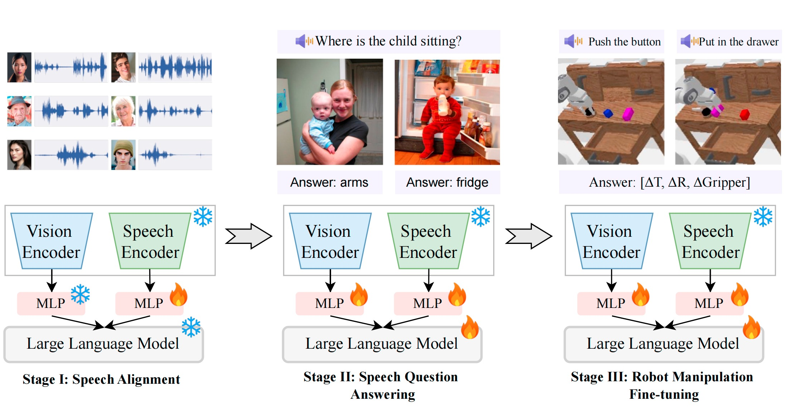

# VLAS Model Three-Stage Training Guide

## Prerequisites

### LLaVA Setup

This repository's implementation is based on the [LLaVA: Large Language and Vision Assistant](https://github.com/haotian-liu/LLaVA) codebase. Before proceeding with model training, please follow the installation instructions and dependency setup from the original LLaVA repository documentation.

### TTS Environment Setup

The TTS (Text-to-Speech) functionality in this repository relies on [ESPnet: end-to-end speech processing toolkit](https://github.com/espnet/espnet). Before synthesizing audio data, ensure that ESPnet is properly configured and installed.

**Important**: We recommend isolating the TTS synthesis environment from the LLaVA training environment by creating two separate conda environments. This isolation helps prevent dependency conflicts and ensures stable operation of both systems.

## Introduction

VLAS (Vision-Language-Action-Speech) is a multimodal robot manipulation model capable of processing visual, language, action, and speech information. This document describes the complete three-stage training pipeline for the VLAS model, including data preparation and training procedures.

## Overview



VLAS training consists of three main stages:
- **Stage 1**: Speech-Text Alignment Pretraining
- **Stage 2**: Multimodal Foundation Model Training (VLAS-Base)
- **Stage 3**: Robot Manipulation Task-Specific Training

## Stage 1: Speech-Text Alignment Pretraining

### Objective
Establish foundational alignment capabilities between speech and text modalities, training the model for speech transcription.

### Data Preparation

#### 1.1 LibriSpeech Data Processing
```bash
# Use LibriSpeech train-clean-100 dataset
python speech/stage1_json_prepare.py
```

**Functionality**:
- Process LibriSpeech train-clean-100 dataset
- Extract audio file paths and corresponding transcription text
- Generate SFT-format JSON training data
- Each sample contains:
  - Audio file path
  - Conversation pairs: Human prompt (with `<audio>` placeholder) + GPT response (correct transcription)

**Output**: JSON training file for establishing audio-text alignment capabilities

### Training
Use the generated JSON file for supervised fine-tuning to establish speech-to-text transcription capabilities.

## Stage 2: Multimodal Foundation Model Training (VLAS-Base)

### Objective
Build a VLM model that supports speech modality input while preserving original performance on vision and language tasks.

### Data Preparation

#### 2.1 ASR Enhancement Data Preparation
```bash
# Use LibriSpeech train-clean-360 dataset
python speech/stage2_asr_json_prepare.py
```

**Functionality**:
- Process LibriSpeech train-clean-360 dataset
- Use diverse transcription instruction templates

#### 2.2 COCO Speech-Image Data Preparation
```bash
# Extract COCO-related QA samples
python speech/prepare_coco_qa.py

# Split data for parallel processing
python speech/prepare_coco_qa_splits.py

# Convert text-image QA to speech-image QA
python speech/tts_coco2speech.py --chunk_idx <gpu_id>
```

**Functionality**:
- Filter COCO image-related QA samples from LLaVA v1.5 mixed dataset
- Use TTS model to synthesize speech from text questions
- Convert text-image QA samples to speech-image QA samples

#### 2.3 Pure Text Data Preparation
```bash
python speech/stage2_puretext_json_prepare.py
```

**Functionality**:
- Extract pure text conversations without images from LLaVA dataset
- Maintain model's text conversation capabilities

#### 2.4 Data Merging
```bash
python speech/stage2_final_json_prepare.py
```

**Functionality**:
- Merge multiple sub-datasets:
  - COCO speech-image data
  - ASR speech data
  - Pure text conversation data that is removed from original LLaVA SFT data just for convenience
  - Remaining parts of original LLaVA SFT mixed dataset that is not used for produce COCO speech-image data
- Generate final Stage 2 training data file

### Training
Train using the merged multimodal data to build the VLAS-Base model.

## Stage 3: Robot Manipulation Task-Specific Training

### Objective
Train the model to perform specific robot manipulation tasks, supporting Vision-Language-Action (VLA) and Vision-Speech-Action capabilities.

### Data Preparation

#### 3.1 Calvin Dataset Processing
```bash
# Convert Calvin dataset to JSON format
cd playground/calvin_data
python calvin2json.py
```

**Functionality**:
- Process Calvin robot manipulation dataset
- Combine multi-view camera observations (static camera + gripper camera)
- Generate composite images (336x336 total size)
- Extract future action sequences for multi-step prediction training
- Generate training samples with language instructions and robot observations

#### 3.2 Speech Instruction Synthesis
```bash
cd playground/calvin_data_audio

# Extract text instructions
python prepare_instructions.py

# Synthesize speech instructions
bash prepare_audios.sh
# Or run individually
python prepare_audios.py
```

**Functionality**:
- Extract unique text instructions from Calvin dataset
- Use TTS technology (ESPnet2 VITS model) to synthesize speech instructions
- Generate diverse speech instructions with 500 different speaker voices
- Create instruction-to-ID mapping

#### 3.3 Mixed-Modal Training Data Generation
```bash
python stage3_json_prepare.py
```

**Functionality**:
- Convert pure text instruction training data to mixed-modal data
- Randomly select 60% of samples to replace text instructions with speech
- Map text instructions to corresponding synthesized audio files
- Update conversation format to include audio placeholders
- Ensure `<audio>` placeholder is positioned after `<image>` placeholder

### Training
Use the updated json file with `<audio>` to train the VLAS model.

## Training Data Organization Structure

### speech/ Directory
Responsible for generating data required for each training stage:
- `stage1_json_prepare.py`: Stage 1 speech-text alignment data
- `stage2_asr_json_prepare.py`: Stage 2 ASR enhancement data
- `stage2_puretext_json_prepare.py`: Stage 2 pure text data
- `stage2_final_json_prepare.py`: Stage 2 data merging
- `prepare_coco_qa.py`: COCO QA data extraction
- `tts_coco2speech.py`: Text-to-speech conversion

### playground/ Directory
Stores specific data for each training stage:
- `data/`: Training data for Stage 1 and Stage 2
- `calvin_data/`: Calvin dataset processing for Stage 3
- `calvin_data_audio/`: Speech instruction synthesis for Stage 3

## Important Notes

- Ensure all dataset paths are correctly configured
- TTS synthesis requires sufficient computational resources and storage space
- Recommend using multi-GPU parallel processing for large-scale data conversion tasks
